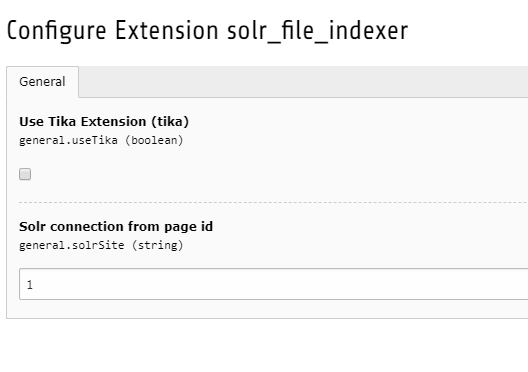

.. ==================================================
.. FOR YOUR INFORMATION
.. --------------------------------------------------
.. -*- coding: utf-8 -*- with BOM.

.. include:: ../Includes.txt

.. _admin-manual:

Installation
============

Import
------

Import Extension from the TYPO3 Extension Repository to your server or use composer for that.

Install
-------

Install the extension in the Extension Manager.

Extension Manager Configuration
-------------------------------

	Extension Manager Configuration

================================ ===============================================================================================
**Use Tika Extension**           Wenn die EXT:tika verwendet wird, kann darüber die Verbindung zum Tika-Server aufgebaut werden.
**Solr connection from page id** Rootpage-ID mit einer Solr-Connection
================================ ===============================================================================================

Static Template
---------------

Fügen Sie solr_file_indexer als statisches Template hinzu, um die Basiskonfiguration für die Index-Queue zu übernehmen.
