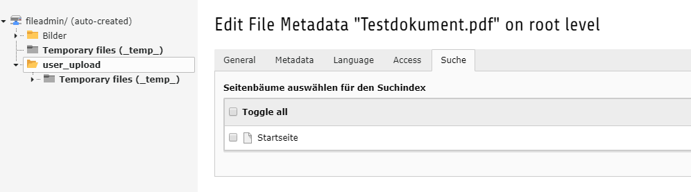

.. ==================================================
.. FOR YOUR INFORMATION
.. --------------------------------------------------
.. -*- coding: utf-8 -*- with BOM.

.. include:: ../Includes.txt

.. _users-manual:

For Editors
===========

Dokumente können in den File Metadaten zum Suchindex hinzugefügt werden.

	Dokument in Suchindex aufnehmen

Individuell pro Seitenbaum kann ein Dokument zum Suchindex hinzugefügt werden. Sobald der Datensatz gespeichert wird, wird ein Eintrag in der Solr
Index Queue erstellt bzw. upgedated. Wenn eine Zuweisung entfernt wird, oder das Dokument in der Filelist gelöscht wird, wird es automatisch aus dem
Solr Index entfernt.

